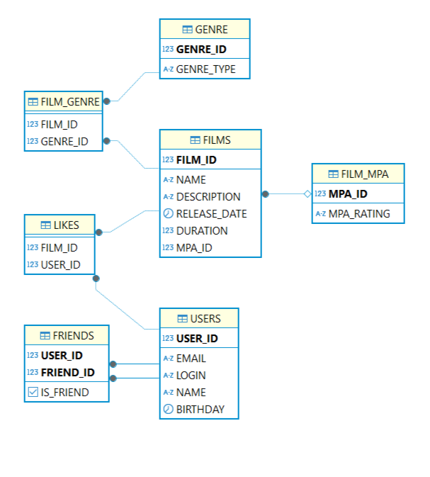

# java-filmorate
Template repository for Filmorate project.

## Диаграмма

Данная диаграмма иллюстрирует структуру базы данных для проекта Filmorate. Она включает в себя основные таблицы, такие как:
- **Users**: информации о пользователях.
- **Films**: информация о фильмах.
- **Likes**: данные о лайках пользователей.
- **Friendships**: данные о дружбе между пользователями.
- **Genres**: жанры фильмов.
- **Mpa**: рейтинги фильмов.
