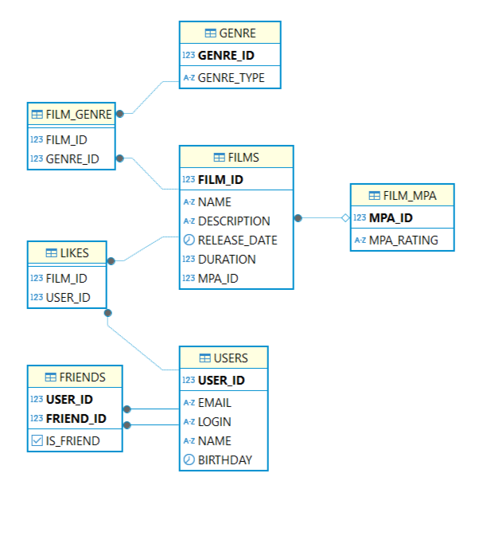

# java-filmorate
Template repository for Filmorate project.

## Диаграмма

Данная диаграмма иллюстрирует структуру базы данных для проекта Filmorate. Она включает в себя основные таблицы, такие как:
- **Users**: информации о пользователях.
- **Films**: информация о фильмах.
- **Likes**: данные о лайках пользователей.
- **Friendships**: данные о дружбе между пользователями.
- **Genres**: жанры фильмов.
- **Mpa**: рейтинги фильмов.

Filmorate: переход на работу с базой данных (спринт 12)
В этом спринте я расширила функциональность Filmorate, внедрив полноценную работу с базой данных. Основная цель — обеспечить сохранение данных пользователей и фильмов между перезапусками приложения, а также подготовить архитектуру проекта к дальнейшему масштабированию.

Что я сделала
🔧 Настроила базу данных H2
Чтобы обеспечить постоянное хранение данных, я подключила в проект H2 в двух режимах:

Файловый режим — используется в рабочем контексте, сохраняет данные на диск.

In-memory режим — используется во время тестирования, очищается после завершения.

Я добавила соответствующие зависимости (h2, spring-boot-starter-jdbc) и сконфигурировала подключение через application.properties.

🧩 Создала структуру БД
На основе логики приложения я спроектировала структуру базы данных и реализовала её в виде SQL-скрипта schema.sql. Скрипт автоматически запускается при старте приложения и создаёт следующие таблицы:

films

users

friends

likes

genres

film_genres

mpa_ratings

Также я обновила модели Film и User, добавив поля mpa и genres.

🗂 Перешла на DAO-архитектуру
Ранее логика хранения была в InMemory*Storage. В этом спринте я добавила новые реализации UserDbStorage и FilmDbStorage, работающие через JdbcTemplate.

Все DAO-реализации внедряются в сервисы с помощью @Qualifier. Таким образом я сохранила зависимость от интерфейсов, а не от конкретных реализаций.

🔄 Расширила бизнес-логику
Я доработала сервисный слой и добавила поддержку жанров и рейтингов в фильмах:

теперь при создании или обновлении фильма передаётся mpa и список genres;

фильмы можно сортировать по популярности (на основе лайков);

дружба стала односторонней: пользователь добавляет друга, но не наоборот.

Эндпоинты были переработаны с учётом новых сущностей.

🌐 Добавила новые эндпоинты
Добавлены:

Метод	URL	Описание
GET	/genres	Получить список всех жанров
GET	/genres/{id}	Получить жанр по идентификатору
GET	/mpa	Получить все рейтинги MPA
GET	/mpa/{id}	Получить рейтинг по идентификатору

🧪 Написала интеграционные тесты
Для DAO-уровня я реализовала интеграционные тесты на основе @JdbcTest и @AutoConfigureTestDatabase. Примеры проверок:

получение пользователя по ID;

сохранение фильма;

получение фильма с жанрами и рейтингом.

Я использовала изолированную H2-базу, инициализируемую из schema.sql, чтобы тесты были повторяемыми и независимыми.

Пример одного из тестов:

java
Копировать
Редактировать
@JdbcTest
@Import({UserDbStorage.class})
class FilmorateApplicationTests {
    @Autowired
    private UserDbStorage userStorage;

    @Test
    void testFindUserById() {
        Optional<User> userOptional = userStorage.findUserById(1);
        assertThat(userOptional)
            .isPresent()
            .hasValueSatisfying(user ->
                assertThat(user).hasFieldOrPropertyWithValue("id", 1)
            );
    }
}
Почему я внедрила эти изменения
Чтобы обеспечить устойчивость данных между сессиями и подготовить проект к использованию настоящей БД в будущем.

Для повышения тестируемости и надёжности — теперь есть полноценные DAO-тесты.

Для разделения ответственности и соблюдения архитектурных принципов: контроллеры отвечают только за обработку запросов, вся логика хранения перенесена в dedicated DAO-слой.

Для масштабируемости: благодаря внедрению зависимостей через интерфейсы, в будущем можно будет заменить JdbcTemplate на JPA без переписывания сервисов.

Технологии
Java 11

Spring Boot

Spring JDBC

H2 Database

Lombok

JUnit 5

Maven

Как запустить проект
bash
Копировать
Редактировать
git clone https://github.com/your-username/filmorate.git
cd filmorate
mvn spring-boot:run
Приложение будет доступно на http://localhost:8080.
